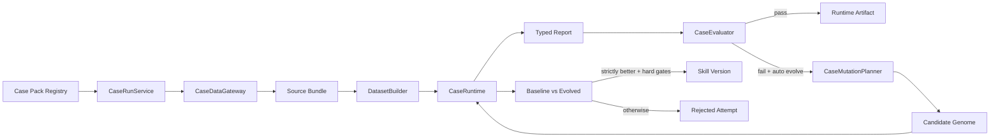

# 从 Finance Case 到通用 Case Runtime 的开发计划

## 1. 目的

本计划负责把已经真实跑通的 Finance Case 逐步迁移成可复用的 Case Runtime，并用第二个真实 Case 验证泛化是否成立。

它解决的是“RogueSkills 内部如何从一个金融专用流程演进成通用流程”，与 `claude-code-mcp-bridge-development-plan.md` 的职责不同：

- MCP 计划负责 Claude Code 如何消费 RogueSkills；
- 本计划负责 RogueSkills 如何用统一机制承载不同真实 Case；
- Finance MCP Bridge 始终通过兼容 API 调用，不等待全部泛化完成；
- 内部泛化完成后，Bridge 不需要推倒重写。

## 2. 已有 Finance Case 基线

当前 Finance Case 已经具备一条完整的真实执行链：

```text
Finance input
→ SecFinanceDataGateway
→ immutable source bundle
→ build_finance_dataset
→ FinanceAnalyst
→ build_finance_report
→ evaluate_finance_report
→ plan/apply finance mutation
→ baseline vs evolved
→ Skill Version
→ Runtime AgentPreset
```

真实基准：

- Case：`finance-case-6266b782a74c416ea985aa35031aee9d`
- Skill Version：`sop-9e7795@2`
- Sources：SEC submissions、SEC company facts、Yahoo Finance market price
- Facts：26
- Score：100.0
- `runtimeVerified=true`
- AgentPreset：`preset-9695e25378e49ce5489c`

当前主要耦合：

| 位置 | 当前耦合 | 泛化方向 |
| --- | --- | --- |
| `FinanceCaseService` | 编排、行业规则、持久化、Artifact 生成混在一起 | `CaseRunService` + Case Pack |
| `SecFinanceDataGateway` | 金融 Provider 固定 | `CaseDataGateway` Port |
| `build_finance_dataset` | XBRL/估值逻辑固定 | `DatasetBuilder` 实现 |
| `FinanceAnalyst` | 金融输入和输出固定 | `CaseRuntime` 实现 |
| `evaluate_finance_report` | 金融 hard gates 固定 | `CaseEvaluator` 实现 |
| `plan_finance_mutation` | 金融 Patch 固定 | `CaseMutationPlanner` 实现 |
| `FinanceCaseRepository` | `finance_case_runs` 单表聚合 | `CaseRunRepository` |
| `/api/finance/cases` | 金融请求模型和路由固定 | 兼容 Facade + `/api/case-runs` |
| `FinanceCasePage.vue` | 页面和指标 renderer 固定 | 通用状态机 + Case renderer |

## 3. 泛化目标

目标执行模型：



通用 Orchestrator 只负责生命周期和不变量，不理解 ticker、SEC、XBRL、Pull Request、网页字段或具体行业指标。

## 4. 必须保持的通用不变量

无论 Case Pack 是金融还是其他场景，都必须满足：

1. Live 模式真实访问 Provider，不能从测试 fixture 偷换数据。
2. Verified Replay 只能引用已经持久化的 Live Source Bundle。
3. Source Snapshot 保留 URL、时间、revision、SHA-256、Provider 和失败状态。
4. Provider fallback 不能删除前一个 Provider 的失败证据。
5. Dataset 的确定性字段、派生值和证据关系不由 LLM 自由计算。
6. Report 必须通过 Case Pack 声明的 Contract。
7. 高分不能绕过 hard gate。
8. 基线通过时记录 `no_mutation_needed`，不制造冗余 Skill Version。
9. Mutation 只有在 evolved 通过、hard gates 通过、score 严格提升时才接受。
10. Rejected Mutation 必须保留，不得修改 Initial Skill。
11. Runtime Artifact 必须绑定 Case Pack、Case Run、Skill Version、Evaluation 和 Digest。
12. `/api/runs` 继续表示现有 Roguelike 数值模拟，不与 Real Case Run 混用。

## 5. 行业能力与通用能力边界

### 5.1 通用核心负责

- Case Pack 查找和版本校验；
- 输入 Contract 校验；
- Case Run 状态和 phase；
- Live/Replay 分支；
- baseline 执行；
- Evaluation 调用；
- Mutation Attempt 生命周期；
- baseline/evolved 比较；
- Skill Version 接受条件；
- Artifact 生成时机；
- 失败、partial state 和 trace；
- 持久化和 API envelope。

### 5.2 Finance Case Pack 负责

- ticker、asOfDate 和 Finance Skill 的校验；
- SEC、Stooq、Yahoo Finance Provider；
- XBRL fact 选择和期间规则；
- 财务 Dataset 和 FCF 等派生指标；
- PE/FCF yield 估值情景；
- Finance Narrative Contract；
- source integrity、financial coverage、citation、valuation 和 advice hard gates；
- Finance Genome Patch 内容；
- Finance Report renderer。

### 5.3 不能放入通用核心的判断

```text
if ticker == ...
if provider == SEC
if metric == free_cash_flow
if scenario == finance
if report contains valuationScenarios
```

通用核心只能通过 Case Pack Protocol 调用行业能力。

## 6. 目标 Contract

### 6.1 Case Pack

```python
class CasePack(Protocol):
    id: str
    version: str
    input_model: type[BaseModel]
    report_model: type[BaseModel]
    runtime_policy: CaseRuntimePolicy

    data_gateway: CaseDataGateway
    dataset_builder: DatasetBuilder
    runtime: CaseRuntime
    evaluator: CaseEvaluator
    mutation_planner: CaseMutationPlanner | None
    artifact_builder: RuntimeArtifactBuilder | None
```

### 6.2 Runtime Ports

```python
class CaseDataGateway(Protocol):
    async def fetch_live(self, case_input, source_policy) -> SourceBundle: ...


class DatasetBuilder(Protocol):
    def build(self, source_bundle, case_input) -> CaseDataset: ...


class CaseRuntime(Protocol):
    async def execute(self, genome, case_input, dataset, feedback) -> TypedReport: ...


class CaseEvaluator(Protocol):
    def evaluate(self, report, dataset, policy) -> EvaluationResult: ...


class CaseMutationPlanner(Protocol):
    def propose(self, genome, evaluation) -> MutationProposal: ...
```

### 6.3 通用 Case Run 输入

```json
{
  "casePackId": "finance-stock-analysis",
  "casePackVersion": "1.0.0",
  "skillId": "sop-9e7795",
  "input": {
    "ticker": "AAPL",
    "asOfDate": "2026-07-21"
  },
  "mode": "live",
  "replayCaseId": null,
  "autoEvolve": true
}
```

### 6.4 通用状态

```text
queued
acquiring_sources
building_dataset
executing_baseline
evaluating_baseline
planning_mutation
executing_evolved
evaluating_evolved
comparing
building_artifact
completed
failed
```

当前 Finance API 的 phase 可以映射到这些状态；兼容响应仍保留原字段。

## 7. 迁移策略

采用兼容 Facade 和逐步替换，不做一次性大爆炸迁移。

```text
阶段 A：给现有 Finance 流程补 characterization tests
阶段 B：抽取 Protocol 和 Case Pack Registry，Finance 行为不变
阶段 C：抽取 CaseRunService，Finance API 继续调用兼容 Facade
阶段 D：引入通用 Repository/API，新 Run 写入通用模型
阶段 E：回填或兼容读取旧 Finance Case
阶段 F：第二个真实 Case 接入
阶段 G：通用 UI 和通用 MCP
```

迁移过程中，已有 Finance Case ID、AgentPreset ID、Digest 和 Source Bundle 不得失效。

## 8. G0：行为冻结与特征测试（08-03）

目标：先锁定现有行为，再移动代码。

- [x] `G0-01` 固定 AAPL 成功 Case 的关键字段快照，不固定随机 UUID 和时间。
- [x] `G0-02` 固定 source-integrity 失败样本。
- [x] `G0-03` 固定 Mutation 引入 advice-boundary 后 rejected 的样本。
- [x] `G0-04` 固定 Stooq 失败、Yahoo fallback 成功且 warning 保留的样本。
- [x] `G0-05` 固定基线通过时 `mutation=null`、`evolved=null`、无新 Skill Version。
- [x] `G0-06` 固定 Verified Replay 不访问 Live Gateway。
- [x] `G0-07` 固定 AgentPreset Digest 校验失败时不能导出。
- [x] `G0-08` 记录 Finance API 和前端当前消费字段。

### G0 Gate

- 重构前所有特征测试通过；
- 成功、失败、fallback、Replay、accepted/rejected/no-op Mutation 均有覆盖；
- 测试 fixture 只通过依赖注入进入测试 App，不可从 Live 配置触达。

## 9. G1：抽取 Case Pack 和 Port（08-04）

目标：先抽接口，不改变执行顺序和持久化。

- [x] `G1-01` 新增 `contracts/case_runtime.py`，定义输入、状态、Source、Evaluation、Mutation 和 Artifact 公共字段。
- [x] `G1-02` 新增 `agents/case_runtime.py`，定义 Runtime Ports。
- [x] `G1-03` 新增 `domain/case_pack.py` 和 Case Pack Registry。
- [x] `G1-04` 实现 `FinanceCasePack`，包装现有 Finance Gateway、Builder、Analyst、Evaluator 和 Planner。
- [x] `G1-05` 将 Finance Skill category 校验移入 Finance Case Pack policy。
- [x] `G1-06` 为 Case Pack ID、version 和 capability 声明增加校验。
- [x] `G1-07` 禁止注册重复 Case Pack ID/version。

### G1 建议代码结构

```text
backend/rogueskills/
├── contracts/case_runtime.py
├── agents/case_runtime.py
├── domain/case_pack.py
└── case_packs/
    └── finance.py
```

### G1 Gate

- Finance 流程通过 `FinanceCasePack` 间接调用原实现；
- Case Pack Registry 单元测试通过；
- 通用模块不 import Finance Contract；
- Finance Live/Replay 行为没有变化。

### G0/G1 执行记录（2026-07-23）

```text
节点：M2-G0/G1 / Characterization + Case Pack Ports
新增：contracts/case_runtime.py
新增：agents/case_runtime.py
新增：domain/case_pack.py
新增：case_packs/finance.py
组合根：create_app 注册 finance-stock-analysis@1.0.0
Skill admission：由 Finance Case Pack policy 声明
现有 Finance API：仍走兼容 FinanceCaseService
Python tests：65 passed
Changed-file Ruff：passed
git diff --check：passed
Gate：PASS
```

## 10. G2：抽取通用 Orchestrator（08-05）

目标：将 `FinanceCaseService` 中的共同行为迁移到 `CaseRunService`。

- [x] `G2-01` 创建 Case Run，并持久化 resolved Case Pack 和 Skill Version。
- [x] `G2-02` 统一 Live Source fetch 和 Replay Source load。
- [x] `G2-03` 统一 Dataset build、baseline execute 和 evaluate。
- [x] `G2-04` 统一 Mutation proposal、candidate execute 和 comparison。
- [x] `G2-05` 将接受条件写成通用 Policy：passed + hard gates + strictly better。
- [x] `G2-06` 统一失败捕获、partial state、retryable 和 completedAt。
- [x] `G2-07` 将 Runtime Artifact 生成抽成独立 Port。
- [x] `G2-08` 保留 Finance Evolution Run/AgentPreset 的兼容 Artifact Builder。
- [x] `G2-09` 将 `FinanceCaseService` 缩减为参数转换和兼容 Facade。

### G2 Gate

- `CaseRunService` 中没有 ticker、SEC、valuation 或 Finance hard gate；
- Finance Case 成功和失败结果与重构前等价；
- baseline 通过不强制 Mutation；
- rejected Mutation 不写 Skill Version；
- Artifact 只在 final evaluation 通过后生成。

### G2 执行记录（2026-07-23）

```text
节点：M2-G2 / Generic CaseRunService
新增：application/case_run_service.py
新增：domain/case_run.py
新增：application/finance_artifact_builder.py
FinanceCaseService：兼容 Facade
通用行为验证：non-finance Generic Case Pack
Finance 特征回归：baseline pass / accepted / rejected / replay
Python tests：68 passed
Changed-file Ruff：passed
git diff --check：passed
Gate：PASS
```

## 11. G3：通用持久化（08-06）

目标：先建立安全的通用聚合存储，再逐步拆分明细表，避免一周内同时完成大规模数据库规范化和 Runtime 重构。

### 11.1 第一阶段：通用聚合表

```text
case_runs
├── id
├── case_pack_id / case_pack_version
├── input_json
├── mode / replay_case_id
├── skill_id / base_skill_version_id / evolved_skill_version_id
├── status / phase
├── state_json
├── source_bundle_json
├── created_at / updated_at / completed_at
└── revision
```

- [x] `G3-01` 新增 `CaseRunRow` 和 Alembic migration。
- [x] `G3-02` 新增 `CaseRunRepository`，支持 save/get/list/include_bundle。
- [x] `G3-03` 使用 optimistic revision 或等价机制防止异步状态覆盖。
- [x] `G3-04` 新 Run 写入通用表。
- [x] `G3-05` 旧 `finance_case_runs` 保持只读兼容，不立即删除。
- [x] `G3-06` 增加旧 Finance Case → 通用响应的兼容读取。

### 11.2 第二阶段：明细表拆分

在第二个 Case 证明字段稳定后，再拆分：

```text
case_source_snapshots
case_executions
case_reports
case_evaluations
mutation_attempts
runtime_artifacts
```

- [ ] `G3-07` 定义明细表主外键和不可变字段。
- [ ] `G3-08` Source 原始正文进入 bundle/object storage，API 默认返回摘要。
- [ ] `G3-09` Report、Evaluation 和 Mutation 以 execution/stage 关联。
- [ ] `G3-10` Artifact 保存 Case Pack、Skill Version、Evaluation 和 Digest。
- [ ] `G3-11` 提供幂等 backfill，执行前后记录数量和 digest 对账。

### G3 Gate

- 已有 AAPL Case 可以继续查询；
- 新通用 Case Run 可以保存和恢复完整状态；
- Replay 可以读取正确 Source Bundle；
- migration upgrade/downgrade 在空库和已有库均通过；
- 不删除旧表，不使用 destructive migration。

### G3 第一阶段执行记录（2026-07-23）

```text
节点：M2-G3.1 / Generic Aggregate Persistence
新增表：case_runs
Migration：20260723_0004
新 Run：只写 case_runs
旧 finance_case_runs：保留只读兼容
并发保护：revision + expected_revision
Replay：Source Bundle 可恢复
Python tests：71 passed
Changed-file Ruff：passed
git diff --check：passed
Gate：PASS
```

`G3-07`～`G3-11` 的明细表拆分按计划延后到第二个 Case 证明字段稳定之后，本阶段不提前执行。

## 12. G4：通用 API 与 Finance 兼容层（08-07）

目标：新增通用入口，同时保持 Finance UI 和 MCP Bridge 不变。

### 12.1 通用 API

```text
GET  /api/case-packs
GET  /api/case-packs/{casePackId}
GET  /api/case-runs/preflight?casePackId=...
POST /api/case-runs
GET  /api/case-runs/{caseId}
GET  /api/case-runs/{caseId}/report?stage=...
GET  /api/case-runs/{caseId}/evaluation?stage=...
GET  /api/case-runs/{caseId}/artifact
POST /api/case-runs/{caseId}/replay
```

- [x] `G4-01` 新增 Case Pack list/detail/preflight。
- [x] `G4-02` 新增通用 Case Run create/get/list。
- [x] `G4-03` 新增 Report、Evaluation、Artifact 和 Replay 路由。
- [x] `G4-04` 错误统一包含 code、message、retryable、caseId 和 details。
- [x] `G4-05` OpenAPI 中明确 Live/Replay 和 autoEvolve 的状态修改语义。

### 12.2 Finance 兼容 Facade

- [x] `G4-06` `POST /api/finance/cases` 转换为 `casePackId=finance-stock-analysis`。
- [x] `G4-07` Finance response 保留 `ticker`、`asOfDate`、`financeEvolutionRunId` 和 `agentPreset`。
- [x] `G4-08` Finance GET/report/preset 路由能够读取新旧两种存储。
- [x] `G4-09` 前端 `FinanceCasePage.vue` 不需要在本阶段重写。
- [x] `G4-10` Finance MCP Bridge 继续只依赖稳定兼容 API。

### G4 Gate

- 同一个新 Finance Case 可以通过通用 API 和兼容 API 查询；
- 现有前端 smoke test 不改断言即可通过，或仅增加兼容字段；
- MCP Bridge 不依赖内部 Case Pack Python 类型；
- OpenAPI 和 Pydantic Contract 一致。

### G4 执行记录（2026-07-23）

```text
节点：M2-G4 / Generic Case API + Finance Compatibility
新增：/api/case-packs list/detail
新增：/api/case-runs preflight/create/list/get
新增：report/evaluation/artifact/replay
Finance API：保持原入口与响应字段
Finance MCP：保持原 HTTP API 依赖
通用 API Live + Verified Replay：PASS
Python tests：73 passed
Changed-file Ruff：passed
git diff --check：passed
Gate：PASS
```

## 13. G5：回归、对账与发布 Gate（08-10 ～ 08-11）

- [ ] `G5-01` 跑 Python 全量测试、前端 smoke、type-check、build、Ruff 和 diff check。
- [ ] `G5-02` 对 AAPL Verified Replay 做迁移前后字段对账。
- [ ] `G5-03` 至少跑一次真实 Live Case，确认通用路径可访问正式 Provider。
- [ ] `G5-04` 对比 source count、fact count、evaluation cases、score 和 runtimeVerified。
- [ ] `G5-05` 验证 AgentPreset ID/Digest 规则没有意外改变。
- [ ] `G5-06` 验证旧 Case ID 和旧 Artifact 仍可访问。
- [ ] `G5-07` 验证失败状态和 partial Source Bundle 可恢复。
- [ ] `G5-08` 保存迁移报告和真实 Run Artifact。

### M2 总 Gate

只有同时满足以下条件，Finance Runtime 泛化阶段才算完成：

- Finance 已作为 Case Pack 运行；
- 通用 Orchestrator 没有 Finance 分支；
- Finance API、UI 和 MCP Bridge 保持兼容；
- Live、Replay、失败、fallback 和 Mutation 行为保持；
- 旧数据没有被破坏；
- 新通用 API 可创建和读取 Case；
- 至少一次真实 Live Run 通过。

## 14. G6：第二个真实 Case（08-12 ～ 08-18）

第二个 Case 是泛化验收，不是可选扩展。

### 14.1 推荐场景

优先推荐 `release-readiness`：

- 输入：repository、base branch、candidate ref、asOfTime；
- Sources：GitHub Repository、Pull Request、Check Runs、Release/Commit；
- Dataset：变更规模、CI 状态、review、未解决风险和依赖；
- Report：readiness summary、blocking findings、risk、rollback evidence；
- Hard gates：source integrity、CI evidence、review evidence、no fabricated status；
- Mutation：补足证据步骤、失败回退和输出校验。

### 14.2 任务

- [x] `G6-01` 注册 `release-readiness@1.0.0` Case Pack。
- [x] `G6-02` 实现真实 GitHub Gateway 和 Source Snapshot。
- [x] `G6-03` 实现 Dataset Builder、Typed Report、Evaluator 和 Planner。
- [x] `G6-04` 接入同一个 `CaseRunService` 和 `CaseRunRepository`。
- [x] `G6-05` 跑通 Live Case 和 Verified Replay。
- [x] `G6-06` 验证 Provider failure、hard gate failure 和 rejected Mutation。
- [x] `G6-07` 检查通用 Orchestrator diff，不允许新增行业分支。
- [x] `G6-08` 记录第二 Case 的 Case ID、Source Digest 和 Artifact Digest。

### G6 当前执行记录（2026-07-23）

```text
节点：M3-G6 / Release Readiness Second Real Case
Case Pack：release-readiness@1.0.0
固定 Provider：GitHub REST API
固定端点：repository / candidate commit / check-runs / open pulls
新增 Contract：ReleaseReadinessInput / ReleaseReadinessReport
状态：ready / review / blocked
Hard gates：6
Mutation：accepted + rejected 自动化特征测试 PASS
Live Case：case-run-c13f4265126a4e2ca3eb58b5b61b61f3
Live 结果：openai/openai-python@main；blocked；runtimeVerified=true；score=100
真实 Sources / Facts / Checks：4 / 7 / 19
Source Bundle Digest：sha256:2ee8fdb00d0693de9ae05d5def02df1ecdea8de8934e6ad0afbbfc893d505f64
Live Artifact：artifact-43343ba872d8678c944e
Live Artifact Digest：sha256:43343ba872d8678c944e62bb5b518f507918604dd87ab00d9015165158e51b07
Verified Replay：case-run-6ef697f4ee8745d6b84d91cfe305b07e
Replay Artifact Digest：sha256:c55d438807f8235ecfb3e64af3576227a9abac1573d363286920f005abf8bdbf
Replay 证据：facts/sources 与 Live 相等；Gateway calls 1 → 1
离线 Replay：case-run-81a5c71032b44a5daf3c0b7c4fe035a5；Gateway calls=0；PASS
回归：Python 86 passed；changed-file Ruff PASS；git diff --check PASS；
       frontend smoke 3 passed；Vue type-check/build PASS；Alembic upgrade/downgrade PASS
真实 runner：artifacts/release-e2e-20260723/run_live_release_case.py
真实证据：artifacts/release-e2e-20260723/
Gate：PASS
```

### 泛化成立 Gate

- 新 Case 只新增 Case Pack 和行业实现；
- 不复制 `CaseRunService`、Repository、通用表和状态机；
- 通用 API 不新增行业专用字段；
- Live、Replay、Evaluation、Mutation、Artifact 均可工作；
- Finance 回归仍然通过。

## 15. G7：异步执行与事件（第二 Case 后）

当前 Finance Case 通过同步 HTTP 执行。Claude MCP 和更多 Provider 会放大超时风险，因此泛化稳定后进入异步化：

- [ ] `G7-01` `POST /api/case-runs` 只创建 queued Run，并返回 202 + caseId。
- [ ] `G7-02` Worker 按 phase 执行 Source、Runtime、Evaluation、Mutation 和 Artifact。
- [ ] `G7-03` Repository 使用 revision 防止并发覆盖。
- [ ] `G7-04` 新增 `/events` SSE 或等价状态事件。
- [ ] `G7-05` MCP Bridge 创建 Case 后轮询或订阅，不依赖单次长请求。
- [ ] `G7-06` 失败 Worker 能恢复 partial state，幂等重试不重复创建 Skill Version。
- [ ] `G7-07` Finance 兼容 API 在迁移期可返回 201 同步或 202 异步的明确版本行为。

异步化不是 M2 抽取通用核心的前置条件，不应和第一轮泛化同时实施。

## 16. 前端泛化

前端安排在通用 Runtime 和第二 Case 稳定之后：

```text
FinanceCasePage.vue
→ CaseRunPage.vue（通用状态和时间线）
  ├─ FinanceInputForm / FinanceReportRenderer
  └─ ReleaseInputForm / ReleaseReportRenderer
```

- [ ] `UI-01` 抽取 Case list、run status、phase、evaluation 和 artifact 的通用 composable。
- [ ] `UI-02` Case Pack 提供 input schema 和 renderer key。
- [ ] `UI-03` Source Timeline、Evaluation Matrix、Mutation Diff 和 Artifact 下载通用化。
- [ ] `UI-04` 行业指标和报告展示继续使用专用 renderer。
- [ ] `UI-05` `/finance-demo` 保持兼容，可重定向或包装通用页面。
- [ ] `UI-06` 新增第二 Case 页面，不复制执行状态机。

## 17. 文件迁移清单

| 当前文件 | 迁移动作 | 目标 |
| --- | --- | --- |
| `application/finance_case_service.py` | 缩减 | Finance Facade / Artifact adapter |
| 新增 `application/case_run_service.py` | 新建 | 通用 Orchestrator |
| `domain/finance_case.py` | 保留行业代码 | Finance Dataset/Evaluator/Planner |
| 新增 `domain/case_pack.py` | 新建 | Registry 与 Policy |
| `adapters/finance_data.py` | 保留 | Finance Gateway 实现 |
| `agents/finance_analyst.py` | 适配 Port | Finance Runtime 实现 |
| `infrastructure/finance_case_repository.py` | 兼容读取 | 旧数据 Adapter |
| 新增 `infrastructure/case_run_repository.py` | 新建 | 通用 Repository |
| `contracts/finance_case.py` | 保留 | Finance Typed Report |
| 新增 `contracts/case_runtime.py` | 新建 | 通用 Envelope |
| `api/app.py` | 增加通用路由 | 组合根与兼容 Facade |
| `frontend/.../FinanceCasePage.vue` | 后续抽取 | 通用状态 + Finance renderer |

## 18. 风险与防护

| 风险 | 防护 |
| --- | --- |
| 只有一个 Case 时过度抽象 | Port 只抽现有真实边界，第二 Case 再决定扩展点 |
| 大爆炸迁移导致旧数据不可读 | 新旧 Repository 并存，兼容 Facade 双读，不删除旧表 |
| 通用模型变成 `dict[str, Any]` 黑盒 | Envelope 和公共字段用 Pydantic，行业 payload 由 Case Pack Contract 校验 |
| 泛化时丢失失败证据 | characterization tests 固定 fallback、partial state 和 rejected Mutation |
| Artifact 仍依赖 Finance Run 结构 | 独立 `RuntimeArtifactBuilder`，先保留 Finance adapter |
| 同步执行和异步执行混在一次重构 | M2 保持同步，第二 Case 后单独异步化 |
| MCP 被内部重构拖累 | Bridge 只调用兼容 HTTP API，不 import 内部服务 |
| 测试 fixture 泄露到 Demo | Test dependency injection 与 Live factory 分离 |

## 19. 每阶段记录模板

```text
阶段：
开始日期：
完成日期：
完成任务 ID：
未完成任务 ID：
新增/修改 Contract：
数据库 migration：
兼容性变化：
真实 Case ID：
Replay Case ID：
Artifact Digest：
测试结果：
风险和后续动作：
Gate：PASS / FAIL
```

## 20. 相关计划

- [Claude Code MCP Bridge 开发任务清单](claude-code-mcp-bridge-development-plan.md)
- [Claude Code MCP Bridge 接入方案](claude-code-mcp-bridge-design.md)
- [通用 Real Case Runtime & Evolution 方案](generalized-real-case-runtime-evolution-design.md)
- [真实金融 Case Demo](finance-real-case-demo.md)
