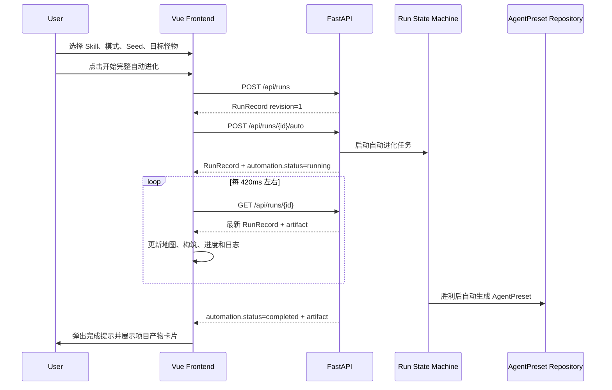

# 前端合并说明：Evolution Run 自动化流程

> 面向前端负责人。本文说明本次“选择怪物后自动跑完整自进化流程”涉及的产品行为、API 契约、前端文件、合并风险和验收方式。

## 1. 这次改动解决什么问题

原来的 Evolution Run 需要用户在每个节点重复执行：

1. 选择路线节点。
2. 点击运行 Benchmark。
3. 选择或跳过 Mutation。
4. 进入下一层后重复以上操作。

现在调整为：

1. 用户在设置页选择 Initial Skill、运行模式、Seed 和若干目标怪物。
2. 用户只点击一次“开始完整自动进化”。
3. 后端自动选择路线、执行 Benchmark、选择 Mutation 并推进三幕流程。
4. 前端只轮询 Run 状态，更新地图、构筑、进度、评估结果和日志。
5. 胜利后后端自动生成并持久化 `AgentPreset`。
6. 前端弹出完成提示，并在右侧项目框中持续展示和导出产物。

如果隐藏验收失败，Run 和 Replay 仍会保留，但不会生成无效项目产物。

## 2. 前后端职责边界

- 路线选择、Benchmark、Mutation 选择、资源变化和胜负判断都在 Python 后端执行。
- 前端不能复制自动选择算法，也不能根据本地数据自行推进 `phase`。
- 前端只负责提交一次自动运行请求，然后通过 `GET /api/runs/{runId}` 读取权威状态。
- 自动运行仍使用 Run Revision 保护；过期命令继续返回 `STALE_RUN_REVISION`。
- 自动运行期间，手动节点命令会返回 `AUTOMATIC_RUN_IN_PROGRESS`。

## 3. 完整调用流程



前端不要新增 `/auto/advance` 调用。自动推进由后端任务完成，轮询只使用现有的 Run GET 接口。

## 4. API 契约变化

### 4.1 `GET /api/evolution/catalog`

新增 `scenarioMonsters`，供设置页按场景展示可选怪物。

```ts
interface ScenarioMonster extends Monster {
  regionId: string
  regionName: string
}

interface EvolutionCatalog {
  // 原有字段保持不变
  scenarioMonsters: {
    browser: ScenarioMonster[]
    finance: ScenarioMonster[]
    [scenarioId: string]: ScenarioMonster[]
  }
}
```

前端当前使用以下规则判断场景：

```ts
const scenarioId = selectedSkill.genome.metadata.category === 'finance'
  ? 'finance'
  : 'browser'
```

默认选择逻辑是每个 Region 预选一个怪物，用户可以继续增删。

### 4.2 `POST /api/runs`

接口没有改动。仍先创建 Run：

```json
{
  "seed": "ROGUE-0714",
  "skillId": "browser-extraction-base",
  "modeId": "stable"
}
```

响应中的 `revision` 必须原样传给下一步自动运行接口。

### 4.3 `POST /api/runs/{runId}/auto`

这是本次新增的启动接口。

请求：

```json
{
  "expectedRevision": 1,
  "selectedMonsterIds": [
    "dirty_slime",
    "canvas_wraith",
    "prompt_mimic"
  ],
  "projectName": "Browser Extraction Base Evolution Project",
  "projectDescription": "从网页中稳定提取结构化业务数据。",
  "scenario": "browser"
}
```

字段限制：

| 字段 | 规则 |
|---|---|
| `expectedRevision` | 整数，至少为 1 |
| `selectedMonsterIds` | 1 到 12 个，必须属于当前 Run 场景 |
| `projectName` | 1 到 160 个字符 |
| `projectDescription` | 1 到 2000 个字符 |
| `scenario` | 1 到 500 个字符 |

响应仍是 `RunRecord`，并带有 `artifact: null`：

```ts
interface RunRecord {
  run: EvolutionRun
  revision: number
  baseSkillVersionId?: string
  artifact?: AgentPreset | null
}
```

### 4.4 `GET /api/runs/{runId}`

该接口现在有两个额外行为：

- 返回当前 Run 对应的 `artifact`；未生成时为 `null`。
- 如果服务重启后读到 `automation.status === 'running'`，会恢复该 Run 的后端自动任务。

因此刷新页面后继续上次 Run 时，前端只需重新调用该接口并恢复轮询。

### 4.5 自动运行状态字段

`EvolutionRun` 新增可选字段 `automation`。旧 Run 没有该字段，前端必须继续兼容旧的手动流程。

```ts
interface RunAutomation {
  status: 'running' | 'completed' | 'failed'
  stage: 'planning' | 'encounter' | 'mutation' | 'artifact' | 'ended'
  message: string
  selectedMonsterIds: string[]
  project: {
    name: string
    description: string
    scenario: string
  }
  completedNodes: number
  totalNodes: number
  progress: number
}
```

字段展示建议：

| 字段 | 前端用途 |
|---|---|
| `status` | 决定显示运行面板、完成弹层或失败结果 |
| `stage` | 展示当前阶段，不用于前端决策 |
| `message` | 后端生成的当前状态文案 |
| `selectedMonsterIds` | 展示目标怪物标签，并在地图节点显示 `TARGET` |
| `completedNodes / totalNodes` | 节点进度文案 |
| `progress` | 0 到 100 的进度条百分比 |
| `project` | 后端生成最终产物时使用的项目信息 |

### 4.6 新增错误码

| HTTP | code | 场景 | 前端处理建议 |
|---|---|---|---|
| 422 | `INVALID_AUTOMATION_MONSTERS` | 选择了不属于当前 Run 场景的怪物 | 回到设置页刷新 Catalog，并提示用户重新选择 |
| 409 | `AUTOMATIC_RUN_IN_PROGRESS` | 自动运行期间调用手动节点命令 | 停止手动请求，恢复 GET 轮询 |
| 409 | `STALE_RUN_REVISION` | 创建和启动之间 Revision 已变化 | 重新 GET Run；不要直接重放旧 Revision |
| 409 | `INVALID_RUN_TRANSITION` | 当前状态不允许启动自动运行 | 重新 GET Run，并按权威状态更新页面 |

## 5. 前端交互变化

### 5.1 设置页

`SetupView.vue` 的整体双栏结构没有改变。右侧配置卡新增：

- “挑战怪物”多选区域。
- 已选择数量。
- Region 名称、怪物名称和失败模式。
- “开始完整自动进化”主按钮。
- 自动 Benchmark、自动 Mutation、自动产物的说明。

没有选择怪物时主按钮禁用，同时 Controller 仍有一次防御性校验。

### 5.2 运行页

地图、左侧构筑、顶部 HUD 和底部 Replay 日志仍保留原结构。

右侧 `ActionPanel` 的渲染优先级必须保持：

```text
automation.status === running
→ 显示自动运行进度面板

否则
→ 按旧 phase 显示 choose_node / encounter / reward / ended
```

自动运行期间：

- 不显示“运行 Benchmark”“选择 Mutation”等手动按钮。
- 地图节点不可手动点击。
- 当前选中节点、已完成节点和日志仍随服务端状态更新。
- 用户选中的怪物节点增加 `TARGET` 标记。
- 最近一次非 utility Benchmark 可以继续展示 EvaluationResult。

### 5.3 完成弹层和项目框

自动运行由 `running` 进入 `completed` 或 `failed` 时显示完成弹层。

胜利：

- 弹层显示项目名称和 Preset ID。
- 右侧 `project-artifact-card` 持续保留产物摘要。
- 可以导出项目产物 JSON。

失败：

- 弹层说明未通过隐藏验收。
- 保留 Run Replay。
- 不显示伪造的项目产物。

`AgentPreset` 仍是 `candidate`，且 `runtimeVerified=false`，不能在前端文案中描述成 Production Release。

## 6. 前端文件改动清单

| 文件 | 本次改动 | 合并注意 |
|---|---|---|
| `frontend/src/types/domain.ts` | 增加 `ScenarioMonster`、`scenarioMonsters`、`run.automation`、`RunRecord.artifact` | 共享契约必须先合入 |
| `frontend/src/api/client.ts` | 增加 `startAutomaticEvolution` | 不要增加前端推进节点的 API |
| `frontend/src/composables/useEvolutionRun.ts` | 怪物选择、默认选择、一次启动、状态轮询、恢复、完成弹层状态和定时器清理 | 冲突最高，建议逐段合并 |
| `frontend/src/components/evolution/SetupView.vue` | 新增怪物多选和自动启动按钮 | 保留原双栏结构 |
| `frontend/src/components/evolution/ActionPanel.vue` | 自动运行状态面板、项目产物卡片、完成态文案 | 自动运行分支必须放在 phase 分支之前 |
| `frontend/src/components/evolution/MapNode.vue` | 自动运行时禁用节点，目标怪物增加 `TARGET` | 不要重新启用点击事件 |
| `frontend/src/components/evolution/RunView.vue` | 完成弹层 | 点击遮罩仅关闭弹层，不改变 Run |
| `frontend/src/views/EvolutionPage.vue` | 页面卸载时调用 `controller.dispose()` | 防止路由切换后残留轮询 |
| `frontend/src/assets/styles.css` | 怪物卡片、自动进度、TARGET、项目框和完成弹层样式 | 可按前端设计系统重写，但 class/状态语义应保留 |

本次没有修改旧的 `src/frontend/app.js`。当前需要合并的是 Vue 3/Vite 前端，即 `frontend/src/`。

## 7. `useEvolutionRun.ts` 合并时必须保留的逻辑

该文件最容易和前端分支冲突，不建议整文件覆盖。至少保留以下行为：

1. `selectedMonsterIds`、`availableMonsters` 和 `selectedScenarioId`。
2. Catalog 加载后，每个 Region 默认选择一个怪物。
3. `startRun()` 先调用 `POST /api/runs`，再使用返回 Revision 调用 `/auto`。
4. 自动运行中每约 420ms 调用 `getEvolutionRun()`，而不是调用手动节点接口。
5. `continueRun()` 读到 `automation.status === 'running'` 后恢复轮询。
6. `returnToSetup()` 和组件卸载时清理定时器。
7. `nodeState()` 在自动运行期间不返回 `available`。
8. `RunRecord.artifact` 需要写入 `agentPreset`。
9. 接收响应时先更新 `artifact`，再更新 `run`，避免 victory watcher 把刚返回的产物清空。
10. 自动流程结束后只弹一次完成层，并停止轮询。

当前轮询不是并行请求：上一轮 GET 返回后才安排下一轮，避免 Revision 和 UI 状态乱序。

## 8. 后端依赖，前端不能单独合并上线

前端改动依赖以下后端能力：

- Catalog 返回 `scenarioMonsters`。
- 新增 `/api/runs/{runId}/auto`。
- Run State 中持久化 `automation`。
- GET Run 返回 `artifact` 并恢复运行任务。
- 胜利后自动创建 `AgentPreset`。
- 自动运行期间阻止手动状态迁移。

本次没有新增数据库表或 Alembic Migration：

- `automation` 保存在已有 Evolution Run 的 `state_json`。
- 最终产物继续使用已有 `agent_presets` 表。

新增后端配置：

```text
ROGUESKILLS_AUTOMATIC_RUN_STEP_DELAY_SECONDS
```

默认是 `0.35` 秒，允许范围 `0` 到 `5` 秒。它控制服务端每次状态推进之间的展示间隔；前端不需要读取该配置。

## 9. 推荐合并顺序

1. 合并后端模型、状态机、API 和测试。
2. 合并 `frontend/src/types/domain.ts`。
3. 合并 `frontend/src/api/client.ts`。
4. 分段合并 `useEvolutionRun.ts`。
5. 合并 Setup、ActionPanel、MapNode 和 RunView。
6. 合并 CSS；如果前端已有新版视觉稿，可以只保留状态 class 后重写样式。
7. 合并 `EvolutionPage.vue` 的卸载清理。
8. 执行类型检查、生产构建和联调验收。

如果前端分支已经重构 Controller，优先移植“状态和调用流程”，不要为了减少冲突而把自动决策搬到组件中。

## 10. 验证命令

在项目根目录执行：

```bash
npm run frontend:type-check
npm run frontend:build
npm run test:frontend
PYTHONPATH=backend .venv/bin/python -m pytest tests/python/test_api.py -q
```

完整回归：

```bash
npm test
PYTHONPATH=backend .venv/bin/python -m pytest tests/python -q
```

## 11. 手工联调清单

- [ ] Browser Skill 时只显示 browser 场景怪物。
- [ ] Finance Skill 时只显示 finance 场景怪物。
- [ ] 默认每个 Region 选择一个怪物。
- [ ] 无怪物选择时不能启动。
- [ ] 点击一次后进入自动运行面板，不再出现逐节点操作要求。
- [ ] 地图、HUD、Build、Evaluation 和 Replay 会持续更新。
- [ ] 目标怪物节点显示 `TARGET`。
- [ ] 自动运行期间地图节点不可点击。
- [ ] 刷新页面并继续 Run 后，自动任务恢复。
- [ ] 胜利后弹出完成提示。
- [ ] 胜利产物保留在右侧项目框，并可导出 JSON。
- [ ] 失败 Run 不生成产物，但保留 Replay。
- [ ] 路由离开 Evolution 页面后不再继续前端轮询。
- [ ] 旧的无 `automation` Run 仍可按原手动流程展示。

## 12. 已有自动验证

`tests/python/test_api.py` 新增了自动流程集成用例，覆盖：

- 创建 Run。
- 选择三类目标怪物。
- 启动后端自动任务。
- 只通过 GET Run 观察进度。
- 三幕流程最终胜利。
- 自动生成 AgentPreset。
- 再次 GET Run 仍可读取同一产物。

当前改动已经通过前端 TypeScript 检查、Vite 生产构建、Node 测试、Python 全量测试和 Ruff 检查。
