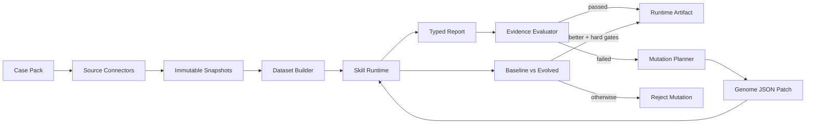

# 通用 Real Case Runtime & Evolution 方案

## 1. 目标与基准

把已经真实跑通的金融股票分析闭环抽象成通用 Case Runtime。新增业务场景时，只需要提供真实数据源 Connector、输入/输出 Contract、Dataset Builder、Evaluator 和 Mutation Planner；核心 Orchestrator、持久化、Replay、Skill Version 与 Runtime Artifact 不按行业复制。

本方案的事实基准是 AAPL Live Case：

- Case ID：`finance-case-6266b782a74c416ea985aa35031aee9d`；
- Skill：`sop-9e7795@2`；
- SEC EDGAR submissions + XBRL company facts；
- Yahoo Finance 基准日前收盘价；
- Stooq 失败 warning 被保留，随后使用真实 fallback；
- 26 个事实；
- Evidence Evaluation：100 分，全部硬门槛通过；
- `runtimeVerified=true`；
- Runtime AgentPreset：`preset-9695e25378e49ce5489c`；
- Preset Digest：`sha256:097a6d1570a0632a0b036c5db45f8e55d026461fae384e4a07a83c8a875d2f0d`。

## 2. 统一执行模型



一次 Run 只有三种合理结果：

1. Initial Skill 已通过：记录 `no_mutation_needed`，不制造无意义版本；
2. Initial Skill 未通过，Mutation 后严格改善且通过硬门槛：接受 Patch，保存新 Skill Version；
3. Mutation 无改善或引入新问题：保存 rejected attempt，不修改 Initial Skill。

## 3. Case Pack Contract

```yaml
id: finance-stock-analysis
version: 1.0.0
input:
  schema: FinanceCaseInput
  required: [ticker, asOfDate, skillId]
sources:
  - id: sec-edgar
    hostAllowlist: [www.sec.gov, data.sec.gov]
    required: true
  - id: market-price
    providers: [stooq, yahoo-finance]
    required: true
dataset:
  builder: rogueskills.domain.finance_case.build_finance_dataset
report:
  schema: FinanceResearchReport
evaluation:
  evaluator: rogueskills.domain.finance_case.evaluate_finance_report
  hardGates: [source-integrity, claim-citations, advice-boundary]
mutation:
  planner: rogueskills.domain.finance_case.plan_finance_mutation
runtime:
  maxMutationAttempts: 1
  timeoutMs: 180000
```

Case Pack 应是声明式注册信息。通用 Orchestrator 不应该出现 `if scenario == "finance"` 之类的行业分支。

## 4. Source Snapshot 与 Replay

所有 Connector 返回统一摘要：

```json
{
  "id": "market-price",
  "provider": "Yahoo Finance",
  "url": "https://query1.finance.yahoo.com/...",
  "fetchedAt": "2026-07-23T02:04:27Z",
  "sha256": "sha256:...",
  "contentType": "application/json",
  "revision": null,
  "status": "captured"
}
```

统一规则：

- Live 模式必须真实访问 Provider 并保存快照；
- 原始正文进入 Source Bundle 或对象存储，API 默认只返回摘要；
- Replay 必须沿用原始 URL、抓取时间、revision 和 SHA-256；
- fallback 不得抹掉第一 Provider 的失败证据；
- Connector 错误统一返回 `provider/code/retryable/message`；
- `configured` 不代表 `reachable`，可达性只能在执行时确认；
- 失败 Run 也保存已获取的 partial snapshots，便于诊断。

本次 AAPL Case 已验证：Stooq 无有效行时保留 warning，Yahoo Finance 作为第二个真实 Provider，硬门槛没有被放宽。

## 5. Dataset 与 Typed Report

Connector 只抓数据；Dataset Builder 负责标准化与确定性计算：

- 字段、单位、币种、期间、发布日期、来源；
- 派生值的公式和 input fact IDs；
- 缺失字段形成 data gap，不填造数据；
- LLM 不参与财务数字计算。

通用 Fact：

```json
{
  "id": "fact-revenue-annual_current",
  "metric": "revenue_annual_current",
  "value": 416160000000,
  "unit": "USD",
  "periodStart": "2024-09-29",
  "periodEnd": "2025-09-27",
  "form": "10-K",
  "filed": "2025-10-31",
  "factName": "us-gaap:RevenueFromContractWithCustomerExcludingAssessedTax",
  "sourceEvidenceId": "sec-companyfacts",
  "sourceUrl": "https://www.sec.gov/Archives/..."
}
```

所有 Runtime 输出 typed Report：

```text
Report
├── identity
├── sources
├── raw events / filings
├── facts
├── derivedMetrics
├── scenarios
├── narrative findings
├── risks
└── dataGaps
```

LLM 只生成 narrative、findings、risks 和 dataGaps；事实、公式和证据集合由确定性代码生成，Evaluator 独立复算。

## 6. 通用 Runtime Port

```python
class CaseDataGateway(Protocol):
    async def fetch(self, case_input, source_policy) -> SourceBundle: ...


class DatasetBuilder(Protocol):
    def build(self, source_bundle, case_input) -> dict[str, Any]: ...


class CaseRuntime(Protocol):
    async def execute(
        self,
        genome,
        case_input,
        dataset,
        feedback,
    ) -> TypedReport: ...


class CaseEvaluator(Protocol):
    def evaluate(self, report, dataset, case_pack) -> EvaluationResult: ...


class CaseMutationPlanner(Protocol):
    def propose(self, genome, evaluation) -> MutationProposal: ...
```

Finance 实现这些 Port；第二个业务场景不复制 `FinanceCaseService`，而是注册新的 Case Pack。

## 7. Evaluation Policy

### 7.1 硬门槛

硬门槛失败时，分数再高也不能 `runtimeVerified=true`：

- 来源 URL、时间、revision、SHA-256 完整；
- 必需 Provider 数量满足 Case Pack；
- 时效性结论存在 fact-level evidence ID；
- Contract/Schema 校验通过；
- 无越权、买卖指令、收益承诺或场景禁止内容。

### 7.2 统一结果

```json
{
  "score": 100,
  "passed": true,
  "hardGatesPassed": true,
  "cases": [
    {
      "id": "claim-citations",
      "score": 100,
      "weight": 20,
      "passed": true,
      "hardGate": true,
      "details": "valid refs 100%; fact-level findings 100%"
    }
  ],
  "failedCaseIds": [],
  "algorithmVersion": "finance-evidence-evaluator-v1"
}
```

### 7.3 自然语言安全

不能用简单子串判断安全。例如 `No guaranteed return claims` 不能被识别成保证收益。建议：

- 检测正向意图：`you should buy`、`recommend buying`、`建议买入`；
- 对否定声明使用上下文规则；
- 分成 advice、secrets、tool-scope、prompt-injection 多个 case；
- 保存规则版本、命中片段和证据，支持回归。

## 8. Mutation 与版本规则

Mutation 必须是可重放 JSON Patch：

```json
{
  "id": "mutation-...",
  "sourceSkillVersionId": "sop-9e7795@2",
  "reason": "claim-citations; source-integrity",
  "evidenceRefs": ["claim-citations", "source-integrity"],
  "genomePatch": [
    {
      "op": "add",
      "path": "/workflow/steps/-",
      "value": {
        "id": "runtime-evidence-9",
        "order": 9,
        "instruction": "Attach fact IDs to every time-sensitive claim."
      }
    }
  ],
  "tradeoff": "Adds tool calls and latency.",
  "algorithmVersion": "finance-mutation-planner-v1"
}
```

接受条件：

```text
evolved.passed == true
evolved.hardGatesPassed == true
evolved.score > baseline.score
```

否则 Mutation Attempt 保存为 `rejected`，不得修改 Initial Skill。基线 100 分时不新建冗余版本，这是本次最终 AAPL Run 的正确结果。

## 9. Persistence Generalization

当前金融实现用 `finance_case_runs` 保存聚合状态。通用化目标：

```text
case_packs
case_runs
case_source_snapshots
case_executions
case_reports
case_evaluations
mutation_attempts
runtime_artifacts
```

关系：

```text
CasePack 1 ── * CaseRun
CaseRun 1 ── * SourceSnapshot
CaseRun 1 ── * Execution
Execution 1 ── 1 Report
Report 1 ── 1 Evaluation
CaseRun 1 ── * MutationAttempt
CaseRun 1 ── 0..1 RuntimeArtifact
RuntimeArtifact ── SkillVersion
```

迁移顺序：

1. 保留 `/api/finance/cases` 作为兼容入口；
2. 新增通用 `/api/case-runs`；
3. Finance endpoint 内部创建 `casePackId=finance-stock-analysis`；
4. 将 `finance_case_runs` 迁移为兼容读取层；
5. 原 `/api/runs` 继续表示 Roguelike 数值模拟，不能与 Real Case 状态混用。

## 10. 通用 API

```text
GET  /api/case-packs
GET  /api/case-packs/{casePackId}
GET  /api/case-runs/preflight?casePackId=...
POST /api/case-runs
GET  /api/case-runs/{runId}
GET  /api/case-runs/{runId}/events
GET  /api/case-runs/{runId}/report?stage=baseline|evolved|final
GET  /api/case-runs/{runId}/evaluation
GET  /api/case-runs/{runId}/artifact
POST /api/case-runs/{runId}/replay
```

```json
{
  "casePackId": "finance-stock-analysis",
  "skillId": "sop-9e7795",
  "input": {
    "ticker": "AAPL",
    "asOfDate": "2026-07-21"
  },
  "mode": "live",
  "autoEvolve": true
}
```

## 11. Live、Replay 与测试边界

### Live

- 访问真实 Provider；
- 保存真实响应、hash、模型版本、token、延迟和工具调用；
- 失败显示具体 Provider 与 retryable 状态。

### Verified Replay

- 只能从已完成 Live Case 创建；
- 使用原始快照，不访问外部网络；
- 明确标记 `VERIFIED REPLAY`；
- 允许重跑 Evaluator、Mutation 和导出，但不能伪装成最新数据。

### Tests

- Unit/API 测试可使用 `httpx.MockTransport`；
- fixture 不能被生产 Runtime 发现；
- Demo 成功证据必须来自 Live 或 Verified Replay；
- 真实快照样本可做离线回归，但必须保留来源 URL 与 hash。

## 12. 安全与可观测性

- Connector host allowlist、SSRF/DNS 检查、大小限制、重定向限制；
- Provider key 只在后端使用；
- 页面、模型和工具输出全部视为不可信数据；
- LLM 只接收 Dataset 与 Skill Contract，不接收密钥；
- 每个 request、Provider、模型、Execution、Mutation 有 trace ID；
- fallback 不可静默；
- 失败 Run 保留 partial state；
- Artifact 绑定 Case Pack、Skill Version、Evaluation、Source Policy 与 Digest。

## 13. 通用前端

将 `/finance-demo` 抽成 `CaseRunPage`：

1. Case Pack 与 Skill 选择；
2. 参数表单和 Live/Replay；
3. Source Timeline；
4. Baseline Report；
5. Evaluation Matrix；
6. Mutation Attempt；
7. Baseline/Evolved Diff；
8. Runtime Artifact 下载；
9. Data Gaps 与失败 Provider。

新增 Case 只提供输入表单、指标 renderer 和报告 renderer，不复制执行状态机。

## 14. 分阶段落地

### P0：抽取通用协议

- `FinanceCaseService` → `CaseRunService`；
- Data Gateway、Builder、Runtime、Evaluator、Planner 注册为 Case Pack；
- 保持 Finance API 兼容；
- 不改变现有数值模拟 `/api/runs`。

### P1：异步与事件

- `POST /api/case-runs` 只创建 queued Run；
- worker 执行 source/runtime/evaluation/mutation；
- SSE 推送 phase 和 Provider 状态；
- UI 不等待长同步 HTTP。

### P2：第二个真实 Case

已选择并实现 `release-readiness@1.0.0`，使用与 Finance 不同的数据形状：

- GitHub repository、candidate commit、check-runs 和 open-pulls 四份快照；
- 确定性 check pass rate、`ready/review/blocked` 三态报告；
- source integrity、finding citations、no fabricated status、CI evidence、
  review-work evidence 和 recommendation consistency 六个硬门槛；
- 通用 Mutation、Skill Version、Artifact 和 Verified Replay。

实现只新增 Release Contract、Gateway、Domain 和 Case Pack，没有复制
`CaseRunService`、Repository、通用表或 API 状态机。真实验收操作见
`release-readiness-real-case.md`。

2026-07-23 真实验收使用 `openai/openai-python@main`：4 个 GitHub Snapshot、7 个
Facts 和 19 个 Check Runs。由于其中 1 个 Check 失败，报告正确给出 `blocked`；六个
证据 hard gates 全部通过，`runtimeVerified=true`、score 100。Live Case 和 Verified
Replay 的 Gateway 调用数保持 `1 → 1`，另一次无 GitHub DNS 的独立进程 Replay 调用数
为 0，证明 Replay 只消费持久化 Source Bundle。

### P3：隐藏验证

- Case Pack 提供 train/validation/hidden 输入；
- Mutation 在当前 Case 改善后，再过隐藏 Case；
- 防止只优化单一公司、单一报告期或单一网页。

### P4：发布策略

- `candidate` 只允许导出和人工审核；
- `runtimeVerified=true` 不等于生产授权；
- 发布、撤回、版本比较和审计导出使用同一 Artifact Digest。

## 15. 泛化验收标准

新增 Case Pack 必须满足：

- 空数据库能通过搜索/导入得到 Initial Skill；
- Live Case 抓取至少两个独立真实来源；若行业只有一个权威 API，Case Pack 必须声明
  固定端点集合并由 Evaluator 分别校验；
- 报告事实和结论可回溯到 Evidence ID；
- 至少一个派生值由 Evaluator 独立复算；
- baseline 通过时不强行 Mutation；
- baseline 失败时 Mutation 被接受或明确拒绝；
- accepted Mutation 才创建 Skill Version；
- Artifact 包含来源摘要、Evaluation、Skill Version 和 Digest；
- Verified Replay 不需要网络并明确标记；
- Provider 失败可在 UI、API、DB 和日志追溯；
- 新 Case Pack 不修改通用 Orchestrator 的行业分支。

## 16. 应保留的负向样本

不要删除前两次真实失败 Case：

- 无第二行情 Provider时，94.8 分仍因 `source-integrity` 硬门槛失败；
- Mutation 重跑引入 advice-boundary 问题时，Mutation 被拒绝；
- Stooq 无数据但 fallback 成功时，warning 被保留。

这些负向样本与最终 100 分 golden run 一起构成泛化后的第一组回归数据。
